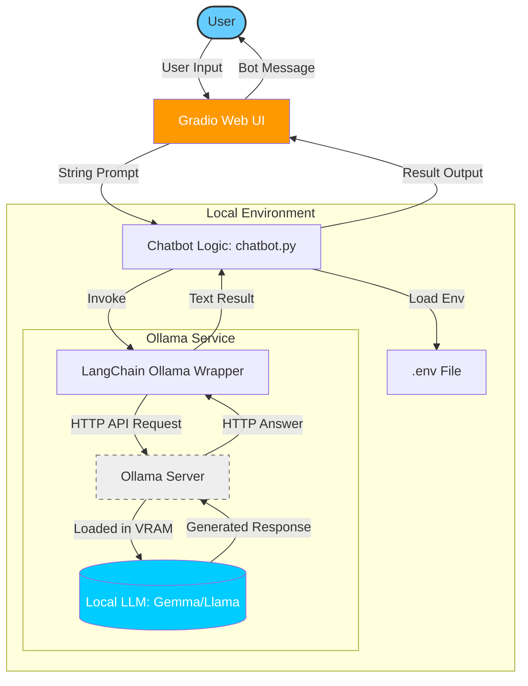

# Chatbot Architecture (Without Memory)

This project consists of a simple local chatbot interface built with **Gradio**, orchestrating **LangChain** to communicate with a local **Ollama** model server.

## Architecture Diagram

## Key Components:
1.  **Gradio (UI)**: Provides a simple web interface for sending and receiving messages.
2.  **LangChain (Framework)**: Standardizes how input is passed to the LLM and processes output.
3.  **ChatOllama (Connector)**: Communicates with your locally running Ollama instance.
4.  **Ollama (Local Inference)**: Runs the actual AI model on your machine's hardware.
